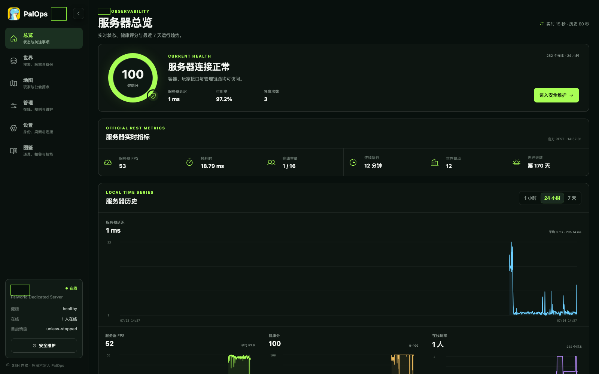
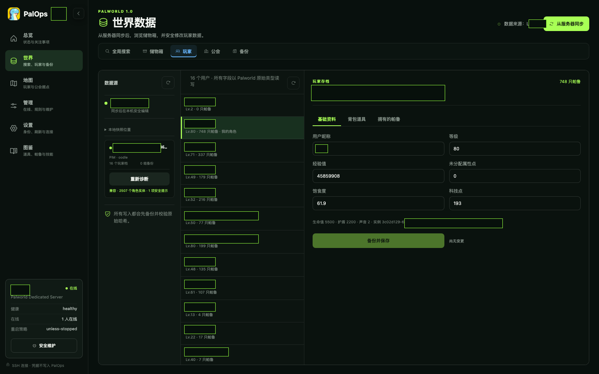
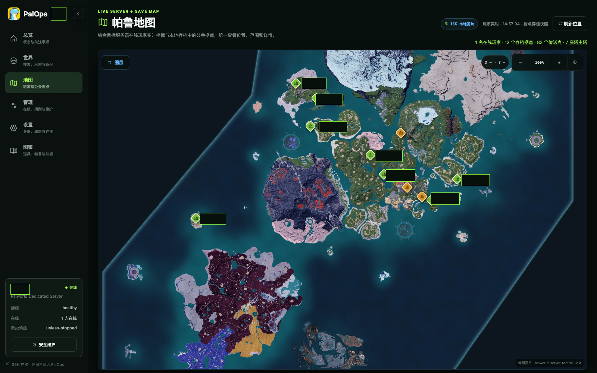
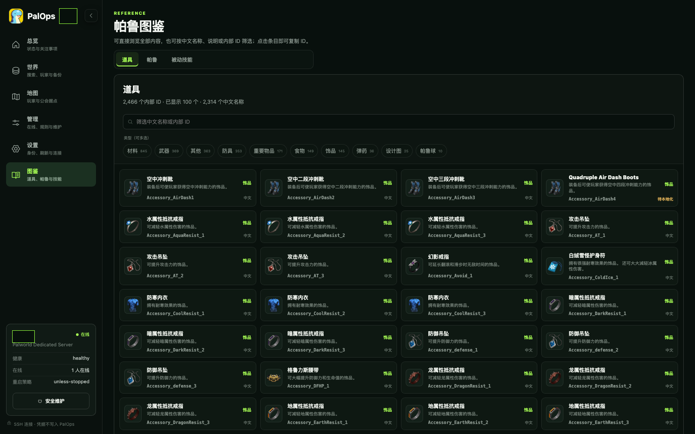
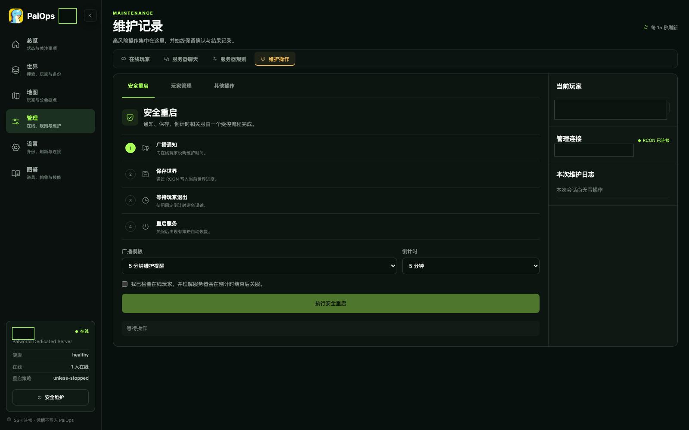

<div align="center">

# PalOps

一个用来管理 Palworld 1.0 专用服务器、只读查看存档的中文 Web 工具。

</div>



PalOps 把服务器状态、在线玩家、地图、维护操作和本地存档管理集中到一个页面。它支持在 macOS 管理机上通过 SSH 连接服务器，也支持通过 Docker Compose 与 Palworld 同机部署。

## 核心功能

- 查看服务器 FPS、延迟、在线人数、运行时间、聊天和历史指标。
- 广播消息、保存世界、管理玩家，并按安全流程关服或重启。
- 查看和修改常用服务器设置。
- 同步并解析 Palworld 1.0 存档，只读查看玩家、帕鲁、背包、储物箱、公会和据点。
- 搜索世界中的道具和帕鲁，查看玩家资料、道具内部 ID 与数量。
- 只读浏览本地备份，在地图上查看玩家、据点、传送点和塔。
- 浏览中文道具、帕鲁和被动技能图鉴。

## 界面预览

### 世界数据

查看玩家、背包、帕鲁、储物箱、公会与备份。当前世界数据界面为只读模式，不提供玩家资料、背包槽位、备份恢复或备份删除入口。



### 地图与图鉴

地图整合在线玩家、本地存档据点、传送点和塔；图鉴支持按中文名称、说明、类型或内部 ID 搜索。





### 服务器维护

按“通知玩家、保存世界、等待退出、关服”的顺序执行维护操作。



## 开始使用

PalOps 支持在管理机上通过 SSH 连接服务器，也支持通过 Docker Direct 与 Palworld 同机运行。完整的环境要求、安装步骤、连接设置、更新方式和网络安全说明见：

**[安装与部署文档](docs/install.md)**

> PalOps 当前没有内置登录界面。不要直接开放到公网；使用 Docker Direct 时还需注意 Docker socket 具有宿主机管理权限。

## 存档安全

本地存档位于：

```text
Save/SaveGames/0/<WorldId>/Level.sav
```

PalOps 会动态发现世界目录。从服务器同步时，存档会先进入临时目录并通过解析检查，再替换本地 `Save/`；旧版本保存在 `.paledit-backups/`。当前网页不提供世界数据编辑、备份恢复或备份删除操作；同步按钮只更新 PalOps 的本地只读快照，不会在服务器运行时替换远端存档。

后端原有存档写入接口暂时保留，但不从网页暴露。Palworld 更新或解析依赖变化后，仍应先用备份副本验证兼容性。

支持 Palworld 1.0 的 `PlM`（Oodle）和旧版 `PlZ`（zlib）存档。无法可靠解析的内容会保持只读或拒绝写入。

## 本机数据与隐私

`Save/`、`.paledit-data/`、`.paledit-backups/` 和 `.artifacts/` 不会提交到 Git。请勿在 Issue、截图、测试或提交中放入真实玩家信息、世界 ID、容器 GUID、SSH 主机名、宿主机绝对路径或任何凭据。

## 开发

```bash
uv sync --extra dev
uv run pytest
uv run palops serve --host 127.0.0.1
```

主要代码位于 `src/paledit/`，图鉴更新脚本位于 `tools/`。涉及存档读取或服务器操作的改动，请同时说明数据来源和验证结果；如需重新开放存档写入，还应单独审查备份、恢复与权限边界。

## 第三方内容

PalOps 代码使用 [MIT License](LICENSE)。图鉴数据、图标和地图瓦片来自固定版本的 `palworld-server-tool`，游戏素材归 Pocketpair 及对应权利人所有。详细来源和许可见：

- [`BRAND_ASSET_NOTICE.txt`](src/paledit/static/BRAND_ASSET_NOTICE.txt)
- [`catalog/THIRD_PARTY_NOTICE.txt`](src/paledit/static/catalog/THIRD_PARTY_NOTICE.txt)
- [`map/THIRD_PARTY_NOTICE.txt`](src/paledit/static/map/THIRD_PARTY_NOTICE.txt)

PalOps 是非官方项目，与 Pocketpair 或 Valve 没有合作或从属关系。

## License

[MIT](LICENSE) © 2026 PalOps contributors
